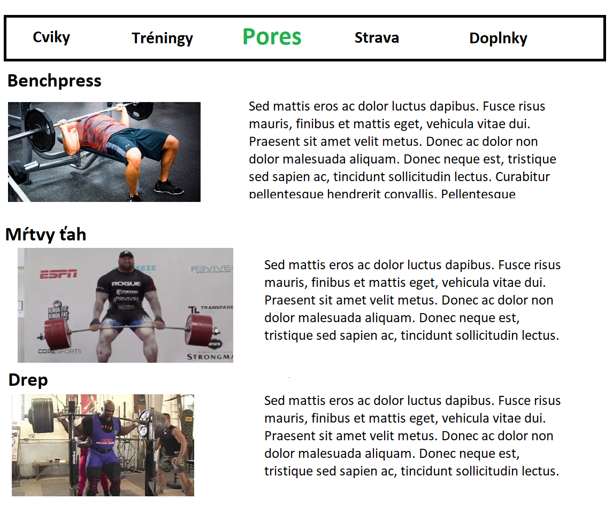
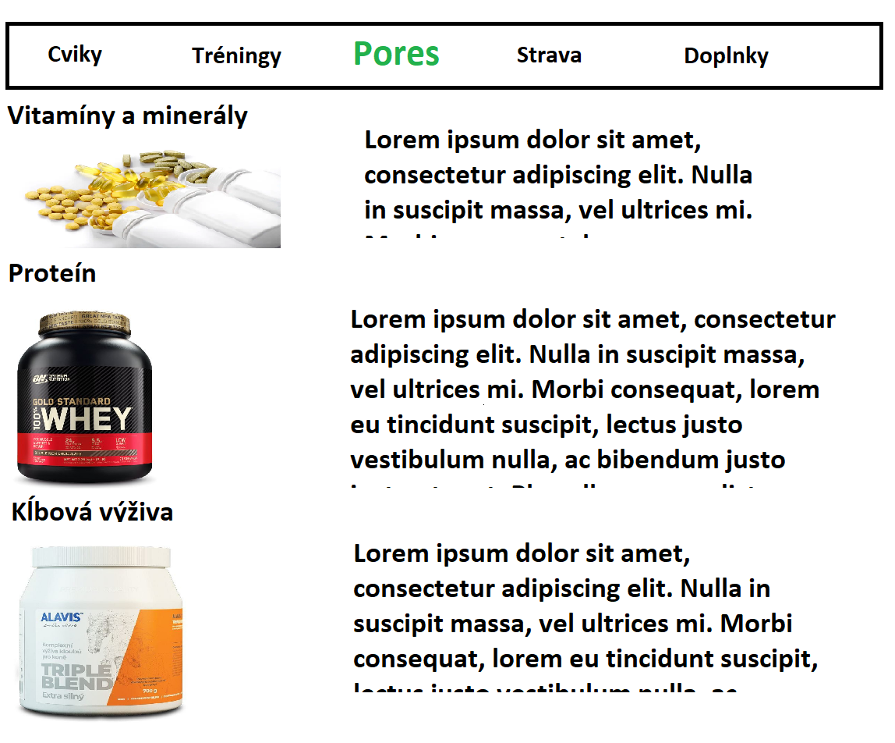

Fitness-Web

Aplikácia, v ktorej budu rozpísane tréningove plány, cviky na rôzne svaloné partie, fitness recepty, doplnky výživy.
 
Členovia Teamu:
- Adrián Kužma (BE)
- Jozef Mravec (BE/FE)
- Roman Kaláb (FE)
- Ľuboslav Isteník (FE)

Čo by sme chceli v aplikácii:

- Recepty
- Tipy/Rady na Fitness
- Cviky
- Info o Doplnkoch
- Login
- Favorites

Cieľ aplikácie:

- Cieľ je namotivovať ľudí na cvičenie.
- Ulahčiť cvičenie pre začiatočníkov.
- Naučiť ľudi sa zdravo stravovať.
- Poučiť o rôznych fitness veciach.

Work Progress:

1. Štvrťrok 
- Urobiť design aplikácie.
- Základnu funkčnosť stránky.
- Pridávať nové cviky.
- Začať s pridávanim prvých článkov.

2. Štvrťrok
- Pokračovať na funkčnosti stránky
- Pridávať dalšie cviky, tipy a rady.
- Začať s infom o doplnkoch a strave.

3. Štvrťrok
- Začať s pridávanim článkov.
- Pridávať stále nové články a veci.
- Začať rozmýšlať o funkčnosti Loginu a Favorites

4. Štvrťrok
- Pridávať finálne veci do aplikácie
- Urobiť Login a Favorites

